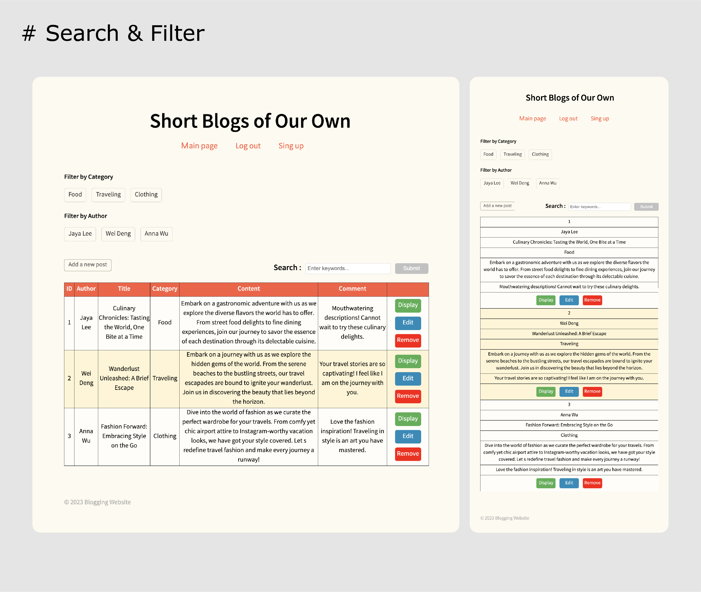

We delved into some seemingly basic functionalities for a whole week, such as how to integrate a database for credential authentication during login, or how to implement keyword search or filtering in articles. I realized that the smooth user experience on a website is actually the result of the hard work of programmers. It's not as easy as it looks.

